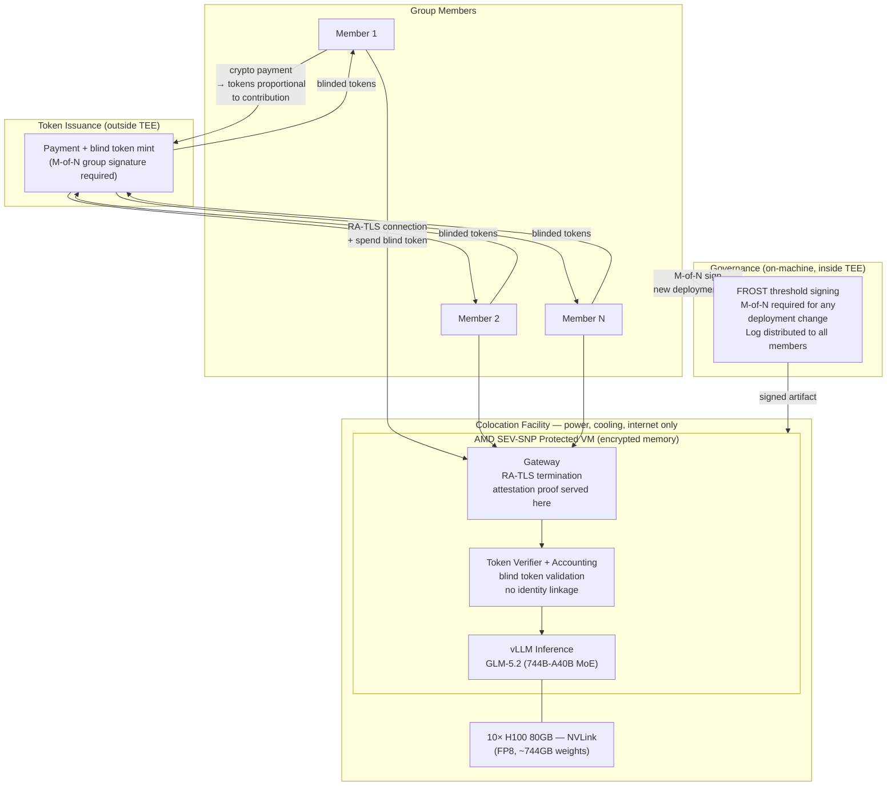
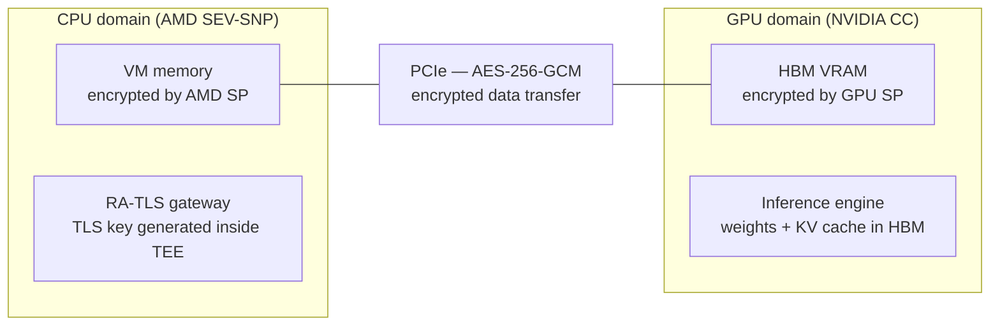
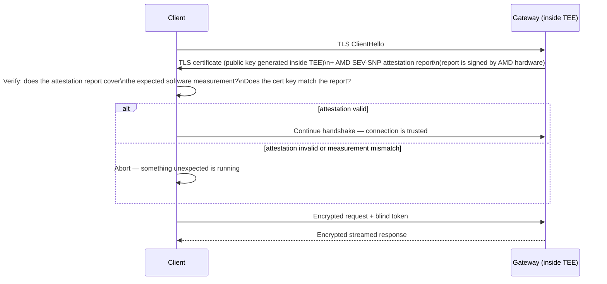
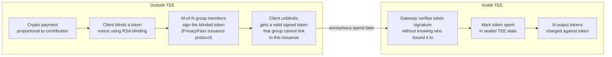
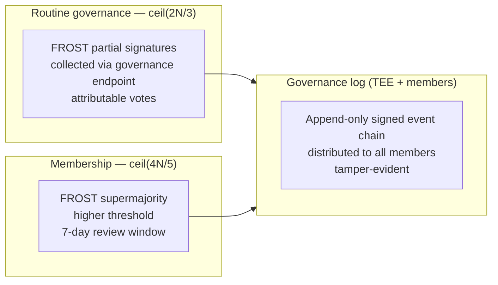

# Architecture

## Why co-location is required

Distributed inference across members' home hardware (3090s, 3070s over the internet) does not produce interactive speeds at 700B scale. The best published result for internet-distributed inference (Petals, BLOOM-176B, 14 servers) is ~0.83 tokens/sec. The bottleneck is physics: autoregressive generation is sequential, and network latency accumulates across every pipeline stage for every token. This cannot be engineered around with current architectures.

**The co-location model**: the group's hardware lives at a facility that provides power, cooling, and internet — and nothing else. The facility operator has no access to what runs on the machines. AMD SEV-SNP enforces this at the hardware level.

---

## System overview

---

## The five layers

### 1. Verification layer — reproducible builds

Every member must be able to independently confirm that what is running matches what the group approved.

- The entire software stack (inference server, gateway, token verifier) is packaged as a **NixOS derivation** — bit-for-bit reproducible from source
- The model weights are fixed by a published SHA-256 hash agreed on by the group (e.g. the official GLM-5.2 release hash from Zhipu AI)
- The combined hash of (software + weights + config) is what AMD SEV-SNP measures and reports in its attestation report
- Any member can rebuild the derivation, compute the expected measurement, and compare it against the attestation report served by the live system

Trust reduces to: "go check it yourself," not "believe the operator."

### 2. Execution layer — AMD SEV-SNP + NVIDIA GPU CC

Two independent hardware trust anchors protect CPU and GPU memory separately.

**CPU — AMD SEV-SNP**: Encrypts all VM memory with a key only the CPU holds. The hypervisor, host OS, and physical DIMM access cannot yield readable memory. Produces a remote attestation report: a hardware-signed statement of what code is running.

**GPU — NVIDIA Confidential Computing (H100+)**: Encrypts HBM (VRAM) with a key generated inside the GPU security processor, never exported. PCIe traffic between CPU and GPU is encrypted AES-256-GCM. The GPU emits its own attestation report through NVIDIA's Remote Attestation Service (NRAS), independently verifiable by the client.

**Attestation chain**: The client receives two attestation reports — one AMD (CPU) and one NVIDIA (GPU) — before establishing the connection. Both must be valid for the connection to proceed.

**NVLink limitation (H100)**: In a multi-GPU SXM system, NVLink traffic between GPUs is not encrypted on H100 (Hopper generation limitation). The NVLink firewall prevents peer GPU memory access, but in-flight activations traversing NVLink are not encrypted. Full NVLink encryption arrives with Blackwell (B200/GB200). See `threat-model.md` T1 for the residual risk assessment.

**Trust roots**: AMD hardware + firmware for CPU; NVIDIA hardware + firmware for GPU. Both are manufacturer trust anchors; neither can be replaced by a colo facility or group member.

### 3. Communication layer — RA-TLS

Standard TLS protects data in transit but still requires trusting whoever terminates the TLS session. RA-TLS (Remote Attestation TLS) binds the TLS key to the attestation report.

The client can verify it is talking to the exact expected software before sending any data. A compromised or substituted server will not produce a valid attestation report.

### 4. Token layer — blind tokens (PrivacyPass)

Usage accounting that cannot build a per-member history.

Properties:
- The group cannot link a spent token to the member who received it during issuance
- Spent tokens cannot be reused (double-spend prevented inside TEE)
- Token balance persists in TEE-sealed storage (encrypted, tied to the SEV-SNP measurement)

**Token unit**: one Sifir token = N LLM output tokens (N set by group governance). Members receive tokens proportional to their financial contribution.

### 5. Governance layer — three-phase model

Governance uses different cryptographic tools for different actions, because the security requirements are not the same.

See [`governance.md`](governance.md) for full detail. Summary:

**Setup (once)**: FROST Distributed Key Generation or a Shamir ceremony produces the group keypair. The private key never exists whole after this point.

**Routine operations** (deployments, policy changes): FROST threshold signing — M-of-N members produce partial signatures that aggregate into a group signature. Individual votes are attributable, which is appropriate for operational decisions.

Governance runs **inside the TEE**, not on any external blockchain. An on-chain DAO would make membership and voting history permanently public — incompatible with the privacy model. All governance logic is part of the verifiable artifact.

**Routine governance** (deployments, policy changes): FROST threshold signing at ceil(2N/3). Votes are attributable.

**Membership admission**: FROST supermajority at ceil(4N/5). Higher bar because the action is hard to reverse.

**Audit trail**: an append-only governance log (signed event chain) lives inside the TEE and is distributed to all members. Any member can verify the full history against the group public key.

Group size N is derived from hardware capacity — see [`hardware.md`](hardware.md). Thresholds are set at the setup ceremony and can only be changed by a routine governance vote.

---

## Hardware

See [`hardware.md`](hardware.md) for specifications and cost estimates.

---

## Open questions (not yet resolved)

- **Geographic distribution of governance keys**: members should hold their signing keys in different jurisdictions to prevent coercion of a quorum
- **Hardware lifecycle**: replacing a failed H100 needs a governance ceremony that does not reintroduce a single trusted provisioner
- **SEV-SNP firmware updates**: AMD periodically releases firmware with security fixes; updating requires a governance vote since it changes the expected measurement
- **Token exchange rate governance**: who sets how many LLM tokens one Sifir token buys, and how is this changed over time?
- **KV cache and context length**: at 1M context, KV cache can exceed 100GB; the FP8 10×H100 config has headroom but this needs benchmarking
