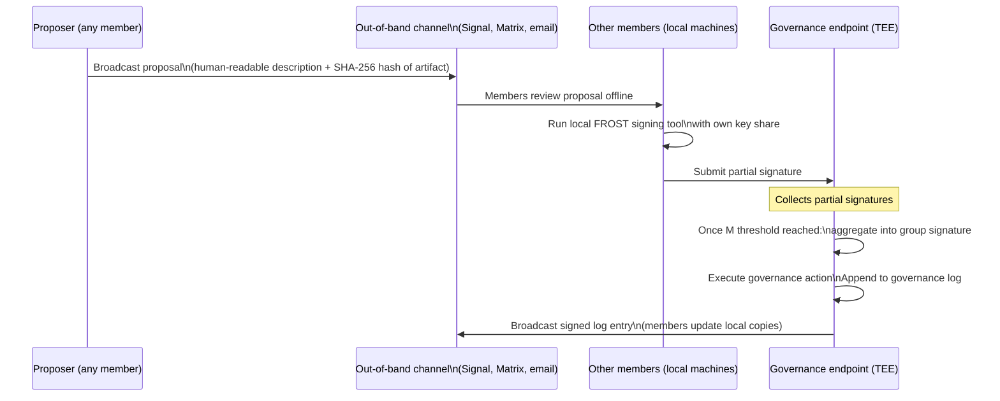
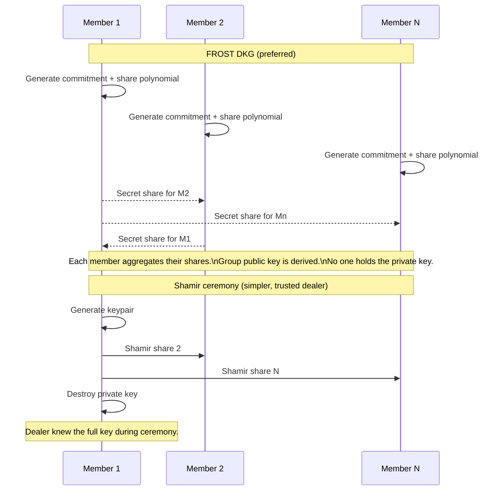
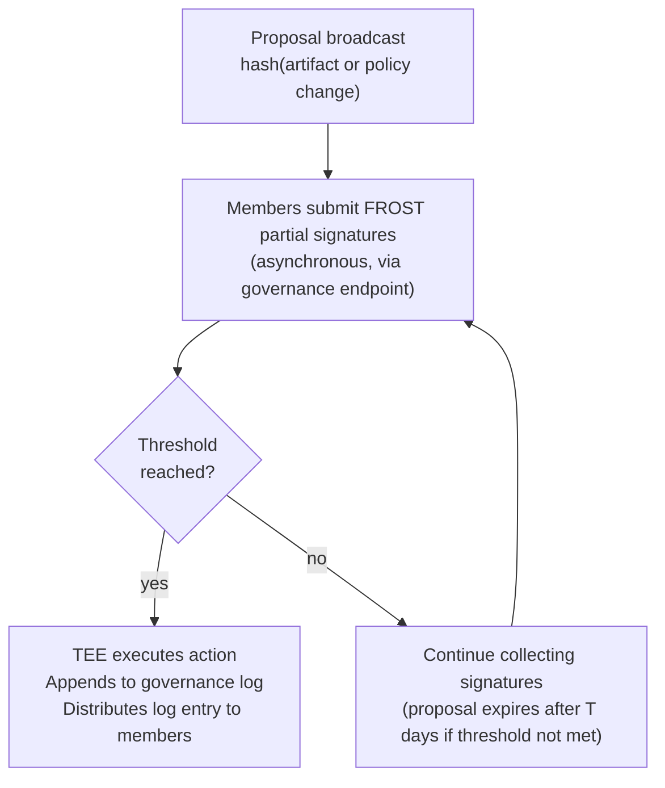
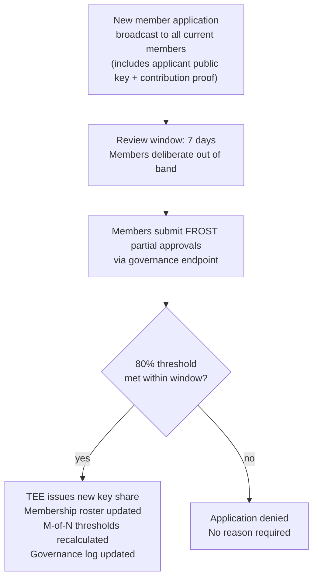
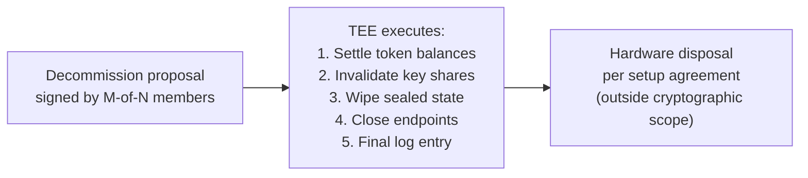

# Governance

Governance in Sifir has three distinct phases that use different cryptographic tools, because the security requirements of each phase are different.

Governance runs **on the machine itself, inside the TEE** — not on any external blockchain or DAO. An on-chain DAO would make membership rosters, voting history, and governance actions permanently public on a global ledger, which directly contradicts the privacy model. All governance logic is part of the verifiable NixOS artifact: any member can read the rules, rebuild the derivation, and confirm what is actually enforced.

---

## Where governance state lives

Governance state (membership roster, token issuance policy, M-of-N threshold, governance log) lives in two places:

1. **Inside the TEE** — sealed storage encrypted to the SEV-SNP measurement. This is the authoritative copy. The TEE enforces governance rules.
2. **Distributed to members** — each member holds a copy of the governance log. This is the audit trail.

The governance log is an append-only chain of signed events:

```
event = {
  sequence:   integer (monotonically increasing)
  action:     proposal hash + action type
  signature:  FROST group signature (proves M-of-N approved)
  prev_hash:  hash of the previous event
  timestamp:  wall-clock time (approximate — not a consensus clock)
}
```

Any member can verify the log against the group public key. If the TEE's sealed state and a member's local log copy ever diverge, the signed log is the audit record for dispute resolution. A TEE that cannot produce a log consistent with member copies has been tampered with — clients will detect this via attestation verification.

---

## How voting works in practice

Voting is asynchronous and happens out of band.



No member needs to be online simultaneously. Partial signatures accumulate until the threshold is met. The TEE is the aggregator and enforcer — it does not need to trust the channel used to coordinate the vote.

---

## Phase 1 — Setup ceremony

Before the cluster operates, the group needs a shared governance keypair that no single member holds.

**Preferred: FROST Distributed Key Generation**
Members run a two-round protocol. No single party generates the full key — each member derives their own key share locally from public commitments. The full private key never exists anywhere. The group's public key is the output.

**Simpler alternative: Shamir ceremony (trusted dealer)**
One member generates the keypair, splits the private key into N Shamir shares, distributes them, and destroys the original. Requires trusting the dealer during the ceremony window. Appropriate for a group that already has a trusted member willing to act as dealer and wants to minimize implementation complexity at the start.



From the ceremony forward, the full private key never exists. All governance actions use FROST partial signatures.

---

## Phase 2 — Routine governance (FROST threshold)

Applies to: software/model updates, token policy changes, hardware expansion or replacement, changes to the M-of-N threshold.

Threshold: **ceil(2N/3)** — two-thirds supermajority. Groups may set a different value at setup.



Partial signatures are attributable — each member's vote is visible to other members. This is appropriate for operational decisions and creates accountability.

---

## Phase 3 — Membership admission (FROST supermajority)

Adding a member is the highest-stakes governance action. It permanently expands the group, changes the M-of-N threshold, and requires a new FROST key share to be issued.

Threshold: **ceil(4N/5)** — 80% supermajority. Higher than routine governance because the decision is irreversible in the short term (removing a member requires another supermajority vote and a full group re-key).



The applicant's public key is included in the proposal hash that members sign. Approving a proposal implicitly approves that specific key — a substituted key would produce a different proposal hash and require a new vote.

**On anonymity**: votes are attributable (visible to other members). For a group of pseudonymous strangers transacting via crypto, this is acceptable — social retaliation risk is low when members do not know each other offline. If a group's threat model requires anonymous voting, threshold ring signatures are the right tool, but they add significant cryptographic complexity and are deferred from the PoC.

---

## Decommissioning

Decommissioning is the one governance action that cannot be fully handled cryptographically, because it involves physical hardware and real money.

**TEE-side (cryptography handles this)**:
1. M-of-N members sign a decommission proposal
2. TEE verifies, then executes:
   - Settles remaining token balances (refunds proportional to unused tokens and contribution share)
   - Invalidates all member key shares
   - Wipes sealed governance state
   - Closes the governance and inference endpoints
3. Final governance log entry is distributed to all members

**Hardware-side (legal agreement handles this)**:
The resale or disposal of physical hardware cannot be enforced cryptographically — it requires either a legal agreement made at group setup time, or a trusted third party to hold proceeds. Recommended: a written agreement at setup defining how hardware value is split on dissolution, signed by all members in their real identities (or pseudonymous identities they commit to for legal purposes).



---

## Governance parameters

| Parameter | What it controls | Suggested default |
|---|---|---|
| N | Total members | Derived from hardware capacity — see hardware.md |
| M_routine | Threshold for deployments, policy changes | ceil(2N/3) |
| M_admit | Threshold for membership admission | ceil(4N/5) |
| M_decommission | Threshold to shut down the cluster | ceil(4N/5) |
| Review window | Time a proposal stays open | 7 days |
| Proposal expiry | Time before an incomplete vote is dropped | 14 days |

Changing any of these parameters is itself a routine governance action (requires M_routine signatures).

---

## Key lifecycle

| Event | Mechanism |
|---|---|
| Initial key generation | FROST DKG or Shamir ceremony |
| Routine signing | FROST partial signatures (M_routine-of-N) |
| New member key issuance | TEE issues share after M_admit approval |
| Member removal | Supermajority vote → full group re-key via new FROST DKG round |
| Lost key recovery | Member proves identity to group (out of band) → M_routine approve new share |
| Decommission | M_decommission sign → TEE wipes all keys and state |

---

## Open questions

- **Proposal communication channel**: members need a way to share proposals and coordinate out of band. The system does not prescribe one — but the channel is outside the trust boundary. A compromised channel cannot forge signatures, but it could suppress proposals. Groups should use a channel with some redundancy (multiple paths).
- **Clock skew**: the governance log uses wall-clock timestamps. These are approximate and not consensus-verified. Good enough for audit purposes; not good enough for anything that needs precise ordering.
- **Hardware replacement ceremony**: replacing a failed GPU changes nothing about governance. Replacing an entire server changes the SEV-SNP measurement — clients will detect the change via attestation. A hardware replacement requires a routine governance vote to approve the new measurement before the cluster is trusted again.
