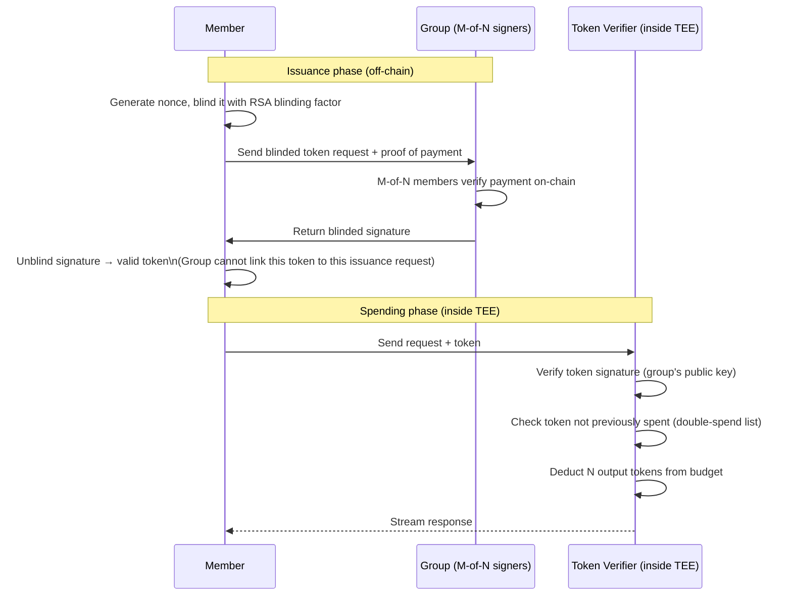
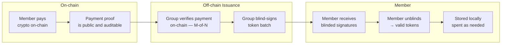

# Token Economics

## Goal

Each member's usage rights should be:
1. **Proportional** to their financial contribution
2. **Anonymous** — spending a token reveals nothing about who holds it
3. **Non-transferable for quota purposes** — a member cannot buy tokens from another member to exceed their fair share (open question: is this desirable?)
4. **Enforceable inside the TEE** — the system cannot be cheated by any party

## Inspiration: Tahoe-LAFS ZKAPs

Tahoe-LAFS (a distributed encrypted storage system) solved a similar problem with Zero-Knowledge Access Proofs (ZKAPs): a client pays a Payment Service Provider, receives cryptographic tokens that represent the right to use storage, and spends those tokens anonymously. The storage server cannot link a spent token to the client who received it.

Sifir uses the same pattern adapted to LLM inference, using the PrivacyPass protocol (IETF RFC 9578) as the token scheme.

## How it works

## Token denomination

One Sifir token = **S output LLM tokens** (where S is set by governance).

Suggested starting point: S = 10,000 output tokens (roughly 7,500 words of output).

The exchange rate between contribution currency and Sifir tokens is set by a governance vote. Changes require M-of-N approval.

## Contribution and token issuance

**Payment**: Lightning Network (fast, low fee, pseudonymous) or on-chain (slower, fully auditable). Group chooses at setup.

**Token batches**: tokens are issued in batches to reduce the number of issuance requests that could be timing-correlated.

## Double-spend prevention

The TEE maintains a spent-token list in sealed storage. Sealed storage is encrypted with a key derived from the SEV-SNP measurement — only the exact same software version can access it. On restart, the sealed state is restored. On redeployment (which changes the measurement), the new deployment must explicitly migrate sealed state as part of the deployment process, which requires a governance vote.

## Fairness under contention

When the inference cluster is at capacity, token holders compete for access. Two options (to be decided by governance):

| Policy | Behavior | Tradeoff |
|---|---|---|
| **Hard quota** | Each member has a per-period token budget; requests fail when exhausted | Simple, predictable, but wasteful if a member doesn't use their full allocation |
| **Fair scheduling** | Requests are queued; members with lower relative usage get priority | Better utilization, but requires tracking per-member relative usage — slight privacy cost |

Fair scheduling requires the TEE to maintain a per-pseudonym usage counter. The pseudonym is linked to the member's token-issuance identity (not their real identity) — this is a weaker privacy guarantee than pure hard quotas.

**Recommendation for PoC**: start with hard quotas. Revisit fair scheduling if utilization patterns make it worthwhile.

## Open questions

- Should unused tokens expire? Expiry creates incentive to use and prevents hoarding, but it may feel punitive.
- Should tokens be transferable between members? Makes sense for flexibility but could enable a secondary market that distorts the intended proportionality.
- Who operates the issuance service? It can be any M-of-N quorum of members running the signing ceremony. It does not need a dedicated server.
- What happens to a member who stops contributing? Their token balance depletes; they do not receive new tokens; their voting weight in governance (if tied to contribution) decreases. The specifics need group agreement.
